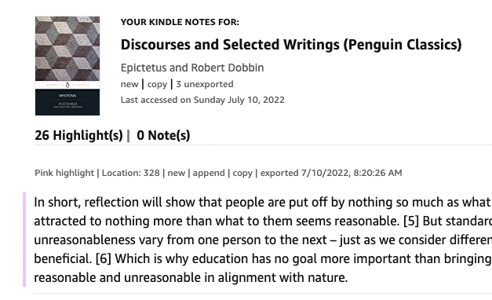

# NotePlan 3 user scripts / toolkit

To use scripts, install [Violentmonkey Chrome extension](https://chrome.google.com/webstore/detail/violentmonkey/jinjaccalgkegednnccohejagnlnfdag)

## Kindle 2 NP3

This user script inserts these clickable links into "Your Notes and Highlights" page:
- "new" -- Create a new note with the book title, adds annotation(s) to it (single or all)
- "append" -- Append annotation(s) (single or all) to an existing note with the book title
- "copy" -- Copies annotation(s) (single or all) to clipboard

In addition, it keeps track of which annotations have been exported by saving to your User Script extension's local storage.

0. Make sure [Violentmonkey Chrome extension](https://chrome.google.com/webstore/detail/violentmonkey/jinjaccalgkegednnccohejagnlnfdag) is installed
1. [Install Kindle 2 NP3 Script](https://raw.githubusercontent.com/jlc467/np3_user_scripts/main/kindle_to_np3.user.js)
2. Go to [https://read.amazon.com/](https://read.amazon.com/) and browse to Notes & Highlights

